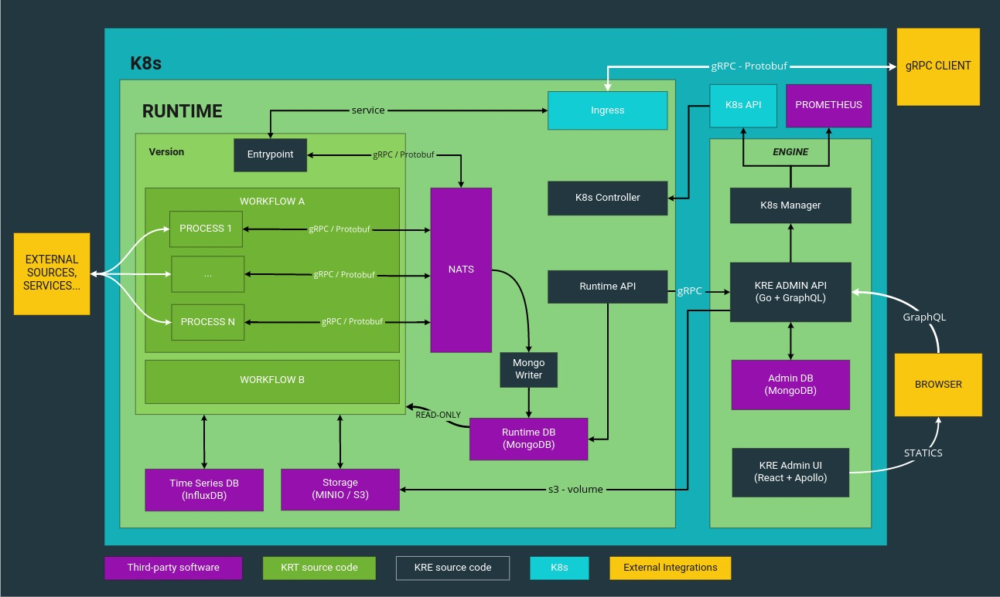

- [KRE (Konstellation Runtime Engine)](#kre-konstellation-runtime-engine)
  - [Engine](#engine)
  - [Runtime](#runtime)
  - [Runners](#runners)
- [Architecture](#architecture)
  - [Engine](#engine-1)
  - [Runtime](#runtime-1)
    - [KRT](#krt)
- [Install](#install)
- [Development](#development)
  - [Requirements](#requirements)
  - [Local Environment](#local-environment)
    - [Login](#login)
  - [Versioning lifecycle](#Versioning-lifecycle)
    - [Alphas](#Alphas)
    - [Releases](#Releases)
    - [Fixes](#Fixes)

# KRE (Konstellation Runtime Engine)

Konstellation Runtime Engine is an application that allow to run AI/ML models for inference based on the content of a
`.krt` file.

## Engine

|  Component  | Coverage  |  Bugs  |  Maintainability Rating  |
| :---------: | :-----:   |  :---: |  :--------------------:  |
|  Admin UI  | [![coverage][admin-ui-coverage]][admin-ui-coverage-link] | [![bugs][admin-ui-bugs]][admin-ui-bugs-link] | [![mr][admin-ui-mr]][admin-ui-mr-link] |
|  Admin API  | [![coverage][admin-api-coverage]][admin-api-coverage-link] | [![bugs][admin-api-bugs]][admin-api-bugs-link] | [![mr][admin-api-mr]][admin-api-mr-link] |
|  K8s Manager | [![coverage][k8s-manager-coverage]][k8s-manager-coverage-link] | [![bugs][k8s-manager-bugs]][k8s-manager-bugs-link] | [![mr][k8s-manager-mr]][k8s-manager-mr-link] |

## Runtime

|  Component  | Coverage  |  Bugs  |  Maintainability Rating  |
| :---------: | :-----:   |  :---: |  :--------------------:  |
|  Mongo Writer  | [![coverage][mongo-writer-coverage]][mongo-writer-coverage-link] | [![bugs][mongo-writer-bugs]][mongo-writer-bugs-link] | [![mr][mongo-writer-mr]][mongo-writer-mr-link] |

## Runners

Each language has a specialized runner associated with it. They are located at the [kre-runners repo](https://github.com/konstellation-io/kre-runners). You must clone that repository in a folder named `runners` at the root level inside this repository.

# Architecture

KRE design is based on a microservice pattern to be run on top of a Kubernetes cluster.

The following diagram shows the main components and how they relate with each other.



Below are described the main concepts of KRE.

## Engine

Before installing KRE an already existing Kubernetes namespace is required. It will be named `kre` by convention, but feel free to use whatever you like. The installation process will deploy some components that are responsible of managing the full lifecycle of this AI solution.

The Engine is composed of the following components:

* [Admin UI](engine/admin-ui/README.md)
* [Admin API](engine/admin-api/README.md)
* [K8s Manager](engine/k8s-manager/README.md)
* [Mongo Writer](engine/mongo-writer/README.md)
* MongoDB
* NATS-Streaming

### KRT

_Konstellation Runtime Transport_ is a compressed file containing the definition of a runtime version, including the code that must be executed, and a YAML file called `kre.yaml` describing the desired workflows definitions.

The generic structure of a `kre.yaml` is as follows:

```yaml
version: my-project-v1
description: This is the new version that solves some problems.
entrypoint:
  proto: public_input.proto
  image: konstellation/kre-runtime-entrypoint:latest

config:
  variables:
    - API_KEY
    - API_SECRET
  files:
    - HTTPS_CERT

nodes:
  - name: ETL
    image: konstellation/kre-py:latest
    src: src/etl/execute_etl.py

  - name: Execute DL Model
    image: konstellation/kre-py:latest
    src: src/execute_model/execute_model.py

  - name: Create Output
    image: konstellation/kre-py:latest
    src: src/output/output.py

  - name: Client Metrics
    image: konstellation/kre-py:latest
    src: src/client_metrics/client_metrics.py

workflows:
  - name: New prediction
    entrypoint: MakePrediction
    sequential:
      - ETL
      - Execute DL Model
      - Create Output
  - name: Save Client Metrics
    entrypoint: SaveClientMetric
    sequential:
      - Client Metrics

```

# Install

KRE can be installed only on top of a Kubernetes cluster, and is packetized as a Helm Chart. In order to install it you just need to add the chart repository, define your custom `values.yaml` file and run one command.

Let's start adding the repository to helm:

```bash
helm repo add konstellation-io https://charts.konstellation.io
helm repo update
```

Now define your custom `values.yaml` file, you can get the default values using this command (this can be used as a template to customize yours later):

```bash
helm show values konstellation-io/kre
```

Once you have customized the values according to your needs, you can start the installation by executing the following command:

```bash
helm upgrade --install kre --namespace kre \
 --values ./custom-values.yaml \
 konstellation-io/kre
```

***NOTE***: The chart default values are also available in this [repository](./helm/kre/values.yaml).

# Development

## Requirements

In order to start development on this project you will need these tools:

- **gettext**: OS package to fill templates during deployment
- **minikube**: the local version of Kubernetes to deploy KRE
- **helm**: K8s package manager. Make sure you have v3+
- **yq**: YAML processor. Make sure you have v4+

*NOTE*: If you still have Helm v2 update variable `$HELM_VERSION` in file `.krectl.conf`.

## Local Environment

This repo contains a tool called `./krectl.sh` to handle common actions you will need during development.

All the configuration needed to run KRE locally can be found in `.krectl.conf` file. Usually you'd be ok with the default values. Check Minikube's parameters if you need to tweak the resources assigned to it.

Run help to get info for each command:

```
$> krectl.sh [command] --help

// Outputs:

  krectl.sh -- a tool to manage KRE environment during development.

  syntax: krectl.sh <command> [options]

    commands:
      dev     creates a complete local environment and auto-login to frontend.
      start   starts minikube kre profile.
      stop    stops minikube kre profile.
      login   creates a login URL and open your browser automatically on the admin page.
      build   calls docker to build all images inside minikube.
      deploy  calls helm to create install/upgrade a kre release on minikube.
      delete  calls kubectl to remove runtimes or versions.

    global options:
      h     prints this help.
      v     verbose mode.
```

### Install local environment

To install KRE in your local environment:

```
$ ./krectl.sh dev
```

It will install everything in the namespace specified in your development `.krectl.conf` file.

### Login to local environment

First, remember to edit your `/etc/hosts`, see `./krectl.sh dev` output for more details.

**NOTE**: If you have the [hostctl](https://github.com/guumaster/hostctl) tool installed, updating `/etc/hosts` will be done automatically too.

Now you can access the admin UI visiting the login URL that will be opened automatically by executing the following script:

```bash
$ ./krectl.sh login [--new]
```

You will see an output like this:

```bash
⏳ Calling Admin API...

 Login done. Open your browser at:

 🌎 http://admin.kre.local/signin/c7d024eb-ce35-4328-961a-7d2b79ee8988

✔️  Done.
```

# Versioning lifecycle

There are three stages in the development lifecycle of KRE there are three main stages depending on if we are going to add a new feature, release a new version with some features or apply a fix to a current release.

### Alphas

To add new features just create a feature branch from main, and after merging the Pull Request a workflow will run the tests. If all tests pass, a new `alpha` tag will be created (e.g *v0.0-alpha.0*), and a new release will be generated from this tag.

### Releases

After releasing a number of alpha versions, you would want to create a release version. This process must be triggered with the Release workflow, that is a manual process.
This workflow will create a new release branch and a new tag following the pattern *v0.0.0*. Along this tag, a new release will be created.

### Fixes

If you find out a bug in a release, you can apply a bugfix just by creating a `fix` branch from the specific release branch, and create a Pull Request towards the same release branch. When merged, the tests will be run against it, and after passing all the tests, a new `fix tag` will be created increasing the patch portion of the version, and a new release will be build and released.


[admin-ui-coverage]: https://sonarcloud.io/api/project_badges/measure?project=konstellation-io_kre_admin_ui&metric=coverage

[admin-ui-coverage-link]: https://sonarcloud.io/component_measures?id=konstellation-io_kre_admin_ui&metric=Coverage

[admin-ui-bugs]: https://sonarcloud.io/api/project_badges/measure?project=konstellation-io_kre_admin_ui&metric=bugs

[admin-ui-bugs-link]: https://sonarcloud.io/component_measures?id=konstellation-io_kre_admin_ui&metric=Reliability

[admin-ui-loc]: https://sonarcloud.io/api/project_badges/measure?project=konstellation-io_kre_admin_ui&metric=ncloc

[admin-ui-loc-link]: https://sonarcloud.io/component_measures?id=konstellation-io_kre_admin_ui&metric=Coverage

[admin-ui-mr]: https://sonarcloud.io/api/project_badges/measure?project=konstellation-io_kre_admin_ui&metric=sqale_rating

[admin-ui-mr-link]: https://sonarcloud.io/component_measures?id=konstellation-io_kre_admin_ui&metric=Maintainability

[admin-api-coverage]: https://sonarcloud.io/api/project_badges/measure?project=konstellation-io_kre_admin_api&metric=coverage

[admin-api-coverage-link]: https://sonarcloud.io/component_measures?id=konstellation-io_kre_admin_api&metric=Coverage

[admin-api-bugs]: https://sonarcloud.io/api/project_badges/measure?project=konstellation-io_kre_admin_api&metric=bugs

[admin-api-bugs-link]: https://sonarcloud.io/component_measures?id=konstellation-io_kre_admin_api&metric=Security

[admin-api-loc]: https://sonarcloud.io/api/project_badges/measure?project=konstellation-io_kre_admin_api&metric=ncloc

[admin-api-loc-link]: https://sonarcloud.io/component_measures?id=konstellation-io_kre_admin_api&metric=Coverage

[admin-api-mr]: https://sonarcloud.io/api/project_badges/measure?project=konstellation-io_kre_admin_api&metric=sqale_rating

[admin-api-mr-link]: https://sonarcloud.io/dashboard?id=konstellation-io_kre_admin_api

[k8s-manager-coverage]: https://sonarcloud.io/api/project_badges/measure?project=konstellation-io_kre_k8s_manager&metric=coverage

[k8s-manager-coverage-link]: https://sonarcloud.io/dashboard?id=konstellation-io_kre_k8s_manager

[k8s-manager-bugs]: https://sonarcloud.io/api/project_badges/measure?project=konstellation-io_kre_k8s_manager&metric=bugs

[k8s-manager-bugs-link]: https://sonarcloud.io/dashboard?id=konstellation-io_kre_k8s_manager

[k8s-manager-loc]: https://sonarcloud.io/api/project_badges/measure?project=konstellation-io_kre_k8s_manager&metric=ncloc

[k8s-manager-loc-link]: https://sonarcloud.io/dashboard?id=konstellation-io_kre_k8s_manager

[k8s-manager-mr]: https://sonarcloud.io/api/project_badges/measure?project=konstellation-io_kre_k8s_manager&metric=sqale_rating

[k8s-manager-mr-link]: https://sonarcloud.io/dashboard?id=konstellation-io_kre_k8s_manager

[mongo-writer-coverage]: https://sonarcloud.io/api/project_badges/measure?project=konstellation-io_kre_mongo_writer&metric=coverage

[mongo-writer-coverage-link]: https://sonarcloud.io/dashboard?id=konstellation-io_kre_mongo_writer

[mongo-writer-bugs]: https://sonarcloud.io/api/project_badges/measure?project=konstellation-io_kre_mongo_writer&metric=bugs

[mongo-writer-bugs-link]: https://sonarcloud.io/dashboard?id=konstellation-io_kre_mongo_writer

[mongo-writer-loc]: https://sonarcloud.io/api/project_badges/measure?project=konstellation-io_kre_mongo_writer&metric=ncloc

[mongo-writer-loc-link]: https://sonarcloud.io/dashboard?id=konstellation-io_kre_mongo_writer

[mongo-writer-mr]: https://sonarcloud.io/api/project_badges/measure?project=konstellation-io_kre_mongo_writer&metric=sqale_rating

[mongo-writer-mr-link]: https://sonarcloud.io/dashboard?id=konstellation-io_kre_mongo_writer
