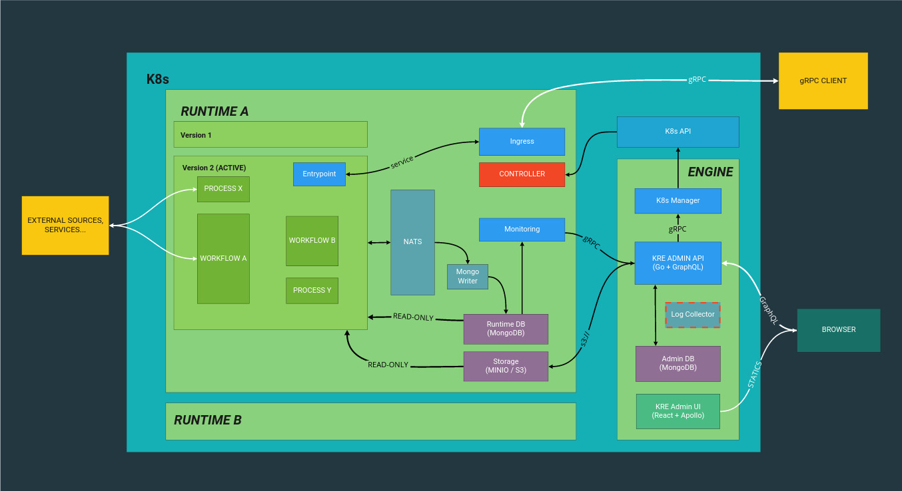

- [KRE (Konstellataion Runtime Engine)](#kre-konstellataion-runtime-engine)
- [Architecture](#archiecture)
  - [Engine](#engine)
  - [Runtime](#runtime)
    - [KRT](#krt)
- [Install](#install)
- [Development](#development)
  - [Deploy local](#deploy-local)

# KRE (Konstellataion Runtime Engine)

Konstellation Runtime Engine is an application that allow to run AI/ML models for inference based on the content of a
 `.krt` file. 

|  Component  | Coverage  |  Bugs  |  Lines of Code  |  Maintainability Rating  |
| :---------: | :-----:   |  :---: |  :-----------:  |  :--------------------:  |
|  Admin UI  | [![coverage][admin-ui-coverage]][admin-ui-coverage-link] | [![bugs][admin-ui-bugs]][admin-ui-bugs-link] | [![loc][admin-ui-loc]][admin-ui-loc-link] | [![mr][admin-ui-mr]][admin-ui-mr-link] |
|  Admin API  | [![coverage][admin-api-coverage]][admin-api-coverage-link] | [![bugs][admin-api-bugs]][admin-api-bugs-link] | [![loc][admin-api-loc]][admin-api-loc-link] | [![mr][admin-api-mr]][admin-api-mr-link] |
| K8s Manager |  |  |  |  |
|  Runtime API  | [![coverage][runtime-api-coverage]][runtime-api-coverage-link] | [![bugs][runtime-api-bugs]][runtime-api-bugs-link] | [![loc][runtime-api-loc]][runtime-api-loc-link] | [![mr][runtime-api-mr]][runtime-api-mr-link] |
|  Operator   |  |  |  |  |
|  Runner Python  | [![coverage][runner-python-coverage]][runner-python-coverage-link] | [![bugs][runner-python-bugs]][runner-python-bugs-link] | [![loc][runner-python-loc]][runner-python-loc-link] | [![mr][runner-python-mr]][runner-python-mr-link] |


[admin-ui-coverage]: https://sonarcloud.io/api/project_badges/measure?project=konstellation_kre_admin_ui&metric=coverage 
[admin-ui-coverage-link]: https://sonarcloud.io/component_measures?id=konstellation_kre_admin_ui&metric=Coverage 
[admin-ui-bugs]: https://sonarcloud.io/api/project_badges/measure?project=konstellation_kre_admin_ui&metric=bugs
[admin-ui-bugs-link]: https://sonarcloud.io/component_measures?id=konstellation_kre_admin_ui&metric=Reliability
[admin-ui-loc]: https://sonarcloud.io/api/project_badges/measure?project=konstellation_kre_admin_ui&metric=ncloc
[admin-ui-loc-link]: https://sonarcloud.io/component_measures?id=konstellation_kre_admin_ui&metric=Coverage
[admin-ui-mr]: https://sonarcloud.io/api/project_badges/measure?project=konstellation_kre_admin_ui&metric=sqale_rating
[admin-ui-mr-link]: https://sonarcloud.io/component_measures?id=konstellation_kre_admin_ui&metric=Maintainability

[admin-api-coverage]: https://sonarcloud.io/api/project_badges/measure?project=konstellation_kre_admin_api&metric=coverage 
[admin-api-coverage-link]: https://sonarcloud.io/component_measures?id=konstellation_kre_admin_api&metric=Coverage 
[admin-api-bugs]: https://sonarcloud.io/api/project_badges/measure?project=konstellation_kre_admin_api&metric=bugs
[admin-api-bugs-link]: https://sonarcloud.io/component_measures?id=konstellation_kre_admin_api&metric=Security
[admin-api-loc]: https://sonarcloud.io/api/project_badges/measure?project=konstellation_kre_admin_api&metric=ncloc
[admin-api-loc-link]: https://sonarcloud.io/component_measures?id=konstellation_kre_admin_api&metric=Coverage
[admin-api-mr]: https://sonarcloud.io/api/project_badges/measure?project=konstellation_kre_admin_api&metric=sqale_rating
[admin-api-mr-link]: https://sonarcloud.io/dashboard?id=konstellation_kre_admin_api

[runtime-api-coverage]: https://sonarcloud.io/api/project_badges/measure?project=konstellation_kre_runtime_api&metric=coverage 
[runtime-api-coverage-link]: https://sonarcloud.io/component_measures?id=konstellation_kre_runtime_api&metric=Coverage 
[runtime-api-bugs]: https://sonarcloud.io/api/project_badges/measure?project=konstellation_kre_runtime_api&metric=bugs
[runtime-api-bugs-link]: https://sonarcloud.io/component_measures?id=konstellation_kre_runtime_api&metric=Security&view=list
[runtime-api-loc]: https://sonarcloud.io/api/project_badges/measure?project=konstellation_kre_runtime_api&metric=ncloc
[runtime-api-loc-link]: https://sonarcloud.io/component_measures?id=konstellation_kre_runtime_api&metric=Coverage&view=list
[runtime-api-mr]: https://sonarcloud.io/api/project_badges/measure?project=konstellation_kre_runtime_api&metric=sqale_rating
[runtime-api-mr-link]: https://sonarcloud.io/component_measures?id=konstellation_kre_runtime_api&metric=alert_status&view=list

[runner-python-coverage]: https://sonarcloud.io/api/project_badges/measure?project=konstellation_kre_py&metric=coverage 
[runner-python-coverage-link]: https://sonarcloud.io/component_measures?id=konstellation_kre_py&metric=Coverage 
[runner-python-bugs]: https://sonarcloud.io/api/project_badges/measure?project=konstellation_kre_py&metric=bugs
[runner-python-bugs-link]: https://sonarcloud.io/component_measures?id=konstellation_kre_py&metric=Security&view=list
[runner-python-loc]: https://sonarcloud.io/api/project_badges/measure?project=konstellation_kre_py&metric=ncloc
[runner-python-loc-link]: https://sonarcloud.io/component_measures?id=konstellation_kre_py&metric=Coverage&view=list
[runner-python-mr]: https://sonarcloud.io/api/project_badges/measure?project=konstellation_kre_py&metric=sqale_rating
[runner-python-mr-link]: https://sonarcloud.io/component_measures?id=konstellation_kre_py&metric=alert_status&view=list


# Architecture

KRE is designed based on a microservice pattern to be run on top of a Kubernetes cluster.

In the following diagram is described the main components and the relationship each other.




Below are described the main concepts of KRE.

## Engine

When you install KRE in your Kubernetes cluster a Namespace called `kre` is created and within this are deployed some 
components. These components are responsible to create new runtimes and expose all the required information to the 
Admin UI.

The Engine is composed by the following components:

* [Admin UI](./admin-ui/README.md)
* [Admin API](./admin-api/README.md)
* [K8s Manager](./k8s-manager/README.md)
* MongoDB

## Runtime

When you create what is called a `runtime`, the Engine create a new Namespace within the Kubernetes cluster with the 
name setted by the user from the Admin UI, and deploy on this Namespace all the base components that are described 
below.

The goal of a Runtimme is to run the designed services within the `.krt` file to perform the inference of a AI/ML model.

Each Runtime is composed by the following components:

* [Operator](operator/README.md)
* [Runtime API](runtime-api/README.md)
* MongoDB
* Minio
* NATS-Streaming

### KRT

Konstellation Runtime Transport is a compressed file with the definition of a runtime version, included the code to 
run and a YAML file called `kre.yaml` with the desired workflows deffinitions.

The base structure of a `kre.yaml` is as follow:

```yaml
version: mettel-tnba-v1
description: This is the new version that solves some problems.
entrypoint: 
  proto: public_input.proto
  image: konstellation/kre-runtime-entrypoint:latest
  src: src/entrypoint.py

config:
  variables:
    - API_KEY
    - API_SECRET
  files:
    - HTTPS_CERT

nodes:
 - name: ETL
   image: konstellation/kre-py:latest
   src: src/etl/execute_etl.py
 
 - name: Execute DL Model
   image: konstellation/kre-py:latest
   src: src/execute_model/execute_model.py

 - name: Create Output
   image: konstellation/kre-py:latest
   src: src/output/output.py

 - name: Client Metrics
   image: konstellation/kre-py:latest
   src: src/client_metrics/client_metrics.py

workflows:
  - name: New prediction
    entrypoint: MakePrediction
    sequential:
      - ETL
      - Execute DL Model
      - Create Output
  - name: Save Client Metrics
    entrypoint: SaveClientMetric
    sequential:
      - Client Metrics

```

# Install

KRE can be installed only on top of a Kubernetes cluster, and is packetized as a Helm Chart. In order to install it 
just need to download the desired Chart version, define your custom `values.yaml` and run the following command.

```bash
helm repo add konstellation-ce https://charts.konstellation.io
helm upgrade --install --namespace kre --values ./custom-values.yaml kre-v1.0.0
```

## Custom Installation
KRE allows a custom configuration to use parts that already exist in your infrastructure.

### Prometheus

- Prometheus will be installed by default if you prefer use your own prometheus, use this helm parameter:

|       Param                | Value |
| -------------------------- | ----- |
| prometheusOperator.enabled | false |

# Development 


## Requirements

In order to start development on this project you will need these tools: 

- **gettext**: OS package to fill templates during deployment
- **minikube**: the local version of Kubernetes to deploy KRE
- **helm**: K8s package manager. Make sure you have v3+

*NOTE*: If you still have Helm v2 update variable `$HELM_VERSION` in file `deploy_local.sh`. 

## Deploy local

Deploy KRE with Helm in Minikube environment

```
$ ./deploy_local.sh
```

### Login

First of all remember to edit your `/etc/hosts`, see `./deploy_local.sh` output for more details.

In order to access the admin app, the login process can be done automatically using this script:

```
$ ./scripts/local_login.sh 
```

You will see an output like this:

```
calling api...
watching /tmp/tmp.c4rBHAglSl
pod kre-local-admin-api-84b5cd84fb-m64hm

 Login done. Open your browser at: 

 🌎 http://admin.kre.local/signin/05fba3e9-e394-461d-b92d-e529950da27c

✔️  Done.
```
