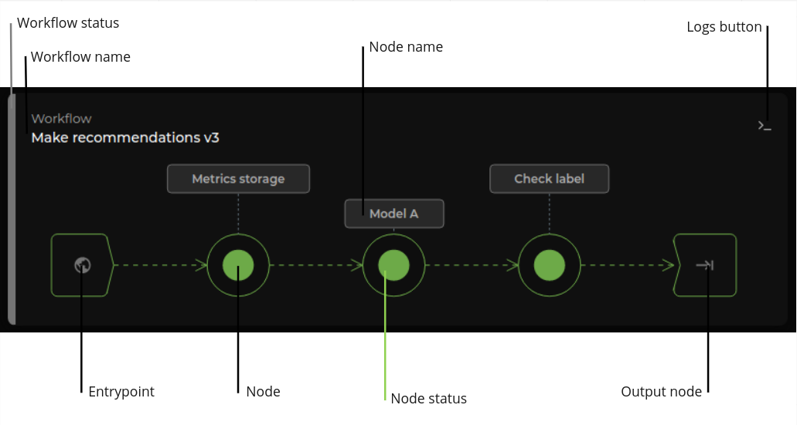
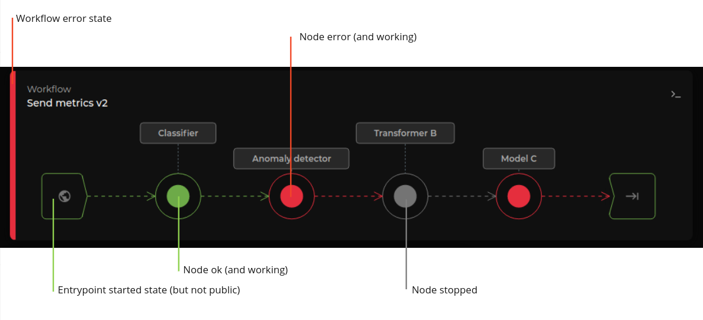

# Version Workflows

A Workflow is a sequence of steps that solves a particular problem. These workflows typically have an input
and output stage and always have a minimum of one intermediate stage. Each intermediate stage splits the
problem into smaller problems so that the solution is simpler and cleaner.

For each version, there could be several workflows and each workflow will have it own representation.

## Elements

A workflow is composed by the following elements:

### Workflow
- title
- status: if the version is running, the status can be `ok` or `error`

### Entrypoint
- shared among all the workflows.
- status

### Nodes
- name
- status

## States

States can be a bit complex to understand as we can face states in different pieces, and some of them are related.

### Version states

A version can be:
- **Stopped:** nothing else could work so states in other elements is also `stopped`.
- **Started:** entrypoint is started but inactive, the remaining nodes, and the workflow can have different states.
- **Published:** entrypoint, workflow and nodes can have different states.

> Note: there could be other states such as `Error` and intermediate states (`Stopping`, `Starting`...)

### Workflow states:

The state of the workflow depends on its nodes:
- **Stopped:** when the version is stopped.
- **OK:** version is not stopped and all nodes are `ok`.
- **Error:** version is not stopped and there is at least one node in `error` state.

> Intermediate states: the workflow can be starting/stopping if a node is in one of these states.

### Entrypoint states:

- **Stopped:** the entrypoint is stopped.
- **Started and not connected:** the entrypoint is working but unconnected to the world.
- **Started and connected:** the entrypoint is working and connected to the world (public).

### Node states:

- **Stopped:** node not working (not consuming resources).
- **Ok:** node working.
- **Error:** node working but with errors.

> Intermediate states: when starting or stopping.

On the image above there is a mixture of states.

